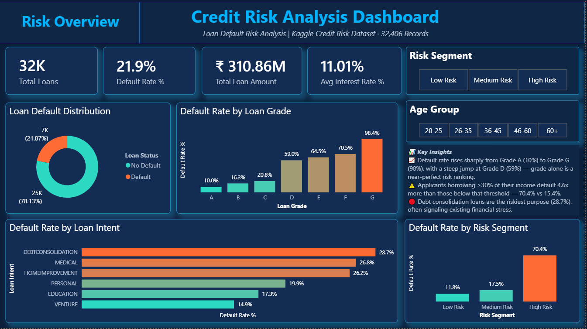
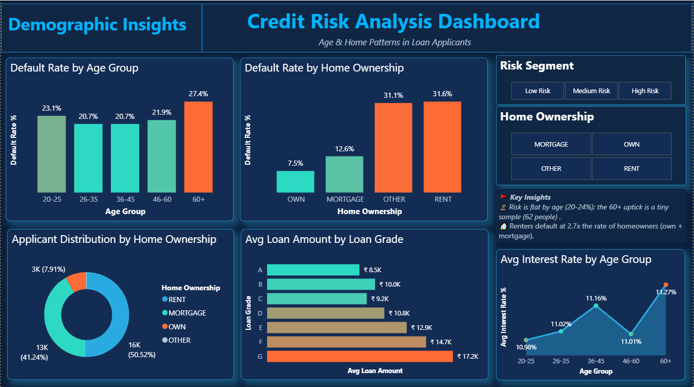
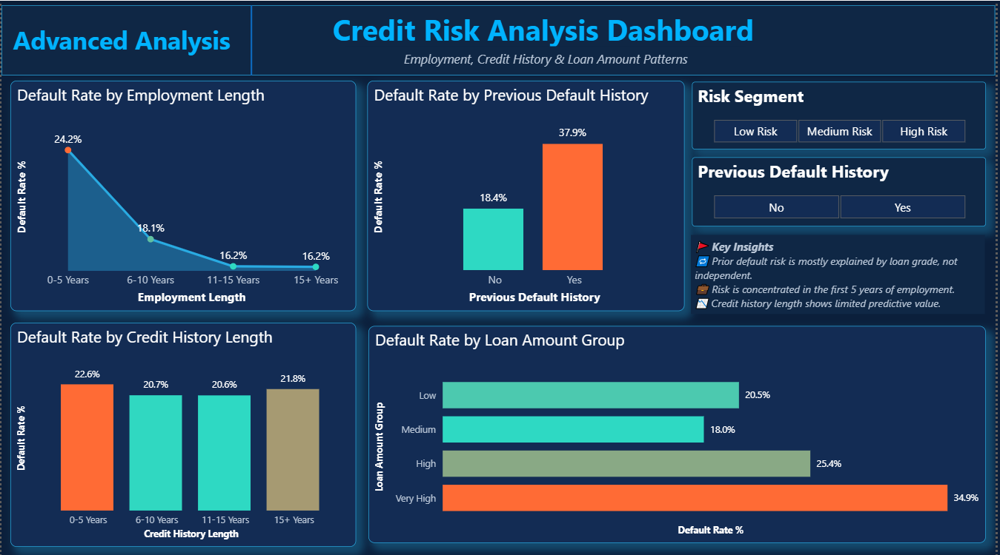

# Credit Risk Analysis: Who Defaults on Loans, and Why?

An end-to-end analysis of **32,406 loan applicants** to find which borrower and loan characteristics are associated with default. Data is cleaned in **Python**, analysed in **PostgreSQL**, and presented in a 3-page **Power BI** dashboard.

---

## Project Pipeline

```
Raw CSV (32,581 rows)
   |
   v
Python (Pandas, Matplotlib, Seaborn)  ->  clean data + visual EDA
   |
   v
Cleaned CSV (32,406 rows, 14 columns)
   |
   v
PostgreSQL  ->  schema + 14 analysis queries + reporting view (loans_view) + 3 KPI queries
   |
   v
Power BI  ->  3-page interactive dashboard
```

---

## Dashboard Preview

**Page 1: Risk Overview** (KPIs, grade, purpose and risk-segment default rates)



**Page 2: Demographic Insights** (age, home ownership, loan amount and interest rate patterns)



**Page 3: Advanced Analysis** (employment, credit history, prior default and loan amount patterns)



---

## Files in this Repo

| File | Purpose |
|------|---------|
| [dataset/raw/credit_risk_dataset.csv](dataset/raw/credit_risk_dataset.csv) | Raw dataset (32,581 rows, 12 columns) |
| [dataset/clean/cleaned_credit_risk_data.csv](dataset/clean/cleaned_credit_risk_data.csv) | Cleaned dataset (32,406 rows, 14 columns) used by SQL and Power BI |
| [notebook/credit_risk_analysis.ipynb](notebook/credit_risk_analysis.ipynb) | Data cleaning, feature grouping and 10 visual analyses in Python |
| [sql/01_schema.sql](sql/01_schema.sql) | Creates the `loans` table |
| [sql/02_analysis.sql](sql/02_analysis.sql) | 14 analytical queries (aggregations, group-wise, window functions, CTEs, business insights) |
| [sql/03_view.sql](sql/03_view.sql) | Creates `loans_view` for Power BI and runs KPI summary queries |
| [powerbi/credit_risk_dashboard.pbix](powerbi/credit_risk_dashboard.pbix) | 3-page Power BI dashboard |
| [images/](images/) | Dashboard screenshots used in this README |
| [INSIGHTS.md](INSIGHTS.md) | Detailed numbered insights with sample sizes and recommendations |
| [CASE_STUDY.md](CASE_STUDY.md) | Business-style write-up of the problem, approach and recommendations |

---

## Tools Used

- **Python**: Pandas, Matplotlib, Seaborn, Jupyter Notebook
- **SQL**: PostgreSQL (CTEs, window functions, CASE bucketing, views)
- **Power BI**: DAX measures, slicers, 3-page dashboard
- **Git / GitHub**: version control and publishing

---

## How to Run

**1. Python notebook**

```bash
pip install pandas matplotlib seaborn jupyter
```

The notebook reads `credit_risk_dataset.csv` from its own folder. So first copy `dataset/raw/credit_risk_dataset.csv` into the `notebook/` folder, then run:

```bash
cd notebook
jupyter notebook credit_risk_analysis.ipynb
```

Run all cells. The cleaned file `cleaned_credit_risk_data.csv` is saved next to the notebook (a ready copy is already in `dataset/clean/`).

**2. SQL (PostgreSQL)**

1. Create a database, for example `credit_risk`.
2. Run `sql/01_schema.sql` to create the `loans` table.
3. Load the cleaned data (run this from the repo root in `psql`):
   ```sql
   \copy loans FROM 'dataset/clean/cleaned_credit_risk_data.csv' WITH (FORMAT csv, HEADER true)
   ```
4. Run `sql/02_analysis.sql` for the analysis queries.
5. Run `sql/03_view.sql` to create `loans_view` and the KPI summary queries.

**3. Power BI**

1. Open `powerbi/credit_risk_dashboard.pbix` in Power BI Desktop.
2. The report was built on the PostgreSQL view `loans_view`. If Power BI asks for a data source, point it to your own PostgreSQL database after completing the SQL steps above.
3. Use the slicers (Risk Segment, Age Group, Home Ownership, Previous Default History) to explore.

---

## Key Findings

- **Overall default rate is 21.87%** (7,088 of 32,406 loans) on a total loan amount of **₹310.86M**.
- **Loan grade separates risk sharply:** default rate rises from **9.96% (Grade A)** to **59.05% (Grade D)**. Grades D to G are 15.1% of loans but 42.2% of all defaults.
- **Loan-to-income above 30% is the strongest affordability signal:** **70.43%** default vs **15.39%** at or below 30% (about 4.6x). This group is 11.8% of applicants but 37.9% of defaults.
- **Renters default at 31.61%** vs **11.80%** for homeowners (own + mortgage), about 2.7x. The gap remains within loan grades A to F.
- **Loan purpose matters moderately:** debt consolidation is highest at **28.68%**, venture is lowest at **14.86%**.
- **Age and credit history length show little pattern** (about 21% to 23% across most groups). Prior-default status mostly overlaps with loan grade.

These are associations found in one dataset snapshot, not proof of cause. See [INSIGHTS.md](INSIGHTS.md) for sample sizes and caveats.

---

## Pipeline Order

1. `notebook/credit_risk_analysis.ipynb` (clean data, export cleaned CSV)
2. `sql/01_schema.sql` (create table)
3. Load `dataset/clean/cleaned_credit_risk_data.csv` into `loans`
4. `sql/02_analysis.sql` (analysis queries)
5. `sql/03_view.sql` (reporting view + KPI queries)
6. `powerbi/credit_risk_dashboard.pbix` (dashboard on top of `loans_view`)

---

## Dataset

- **Source:** Public Kaggle dataset, "Credit Risk Dataset" (loan applicant records).
- **Description:** 32,581 loan records with 12 columns covering applicant age, income, home ownership, employment length, loan purpose, loan grade, loan amount, interest rate, loan-to-income ratio, prior default flag, credit history length, and the target `loan_status` (1 = default, 0 = no default).
- **Note:** The source file does not state a currency, so amounts are shown in ₹ in the dashboard as an assumption. The collection period is also not documented. This project uses the data for learning and portfolio purposes only. Results describe this dataset and should not be assumed to apply to any real lender.
